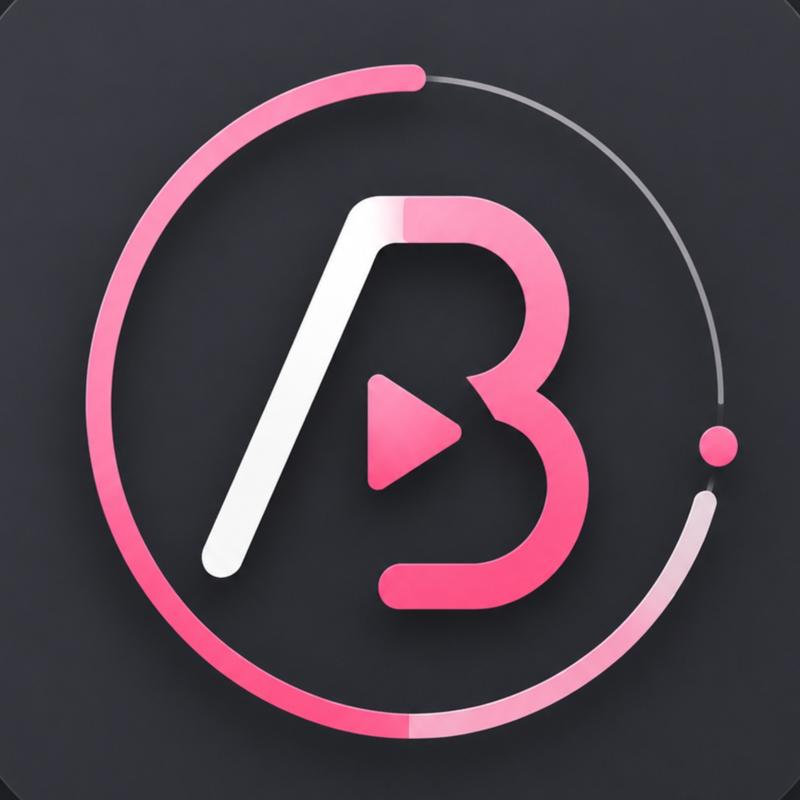
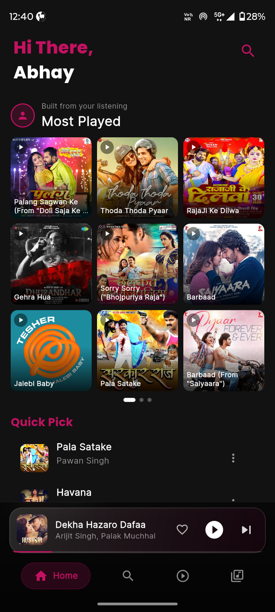
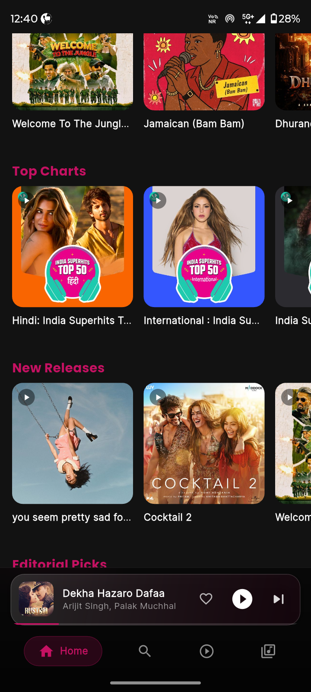
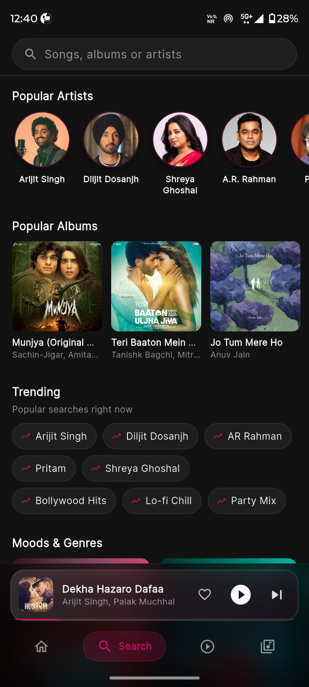
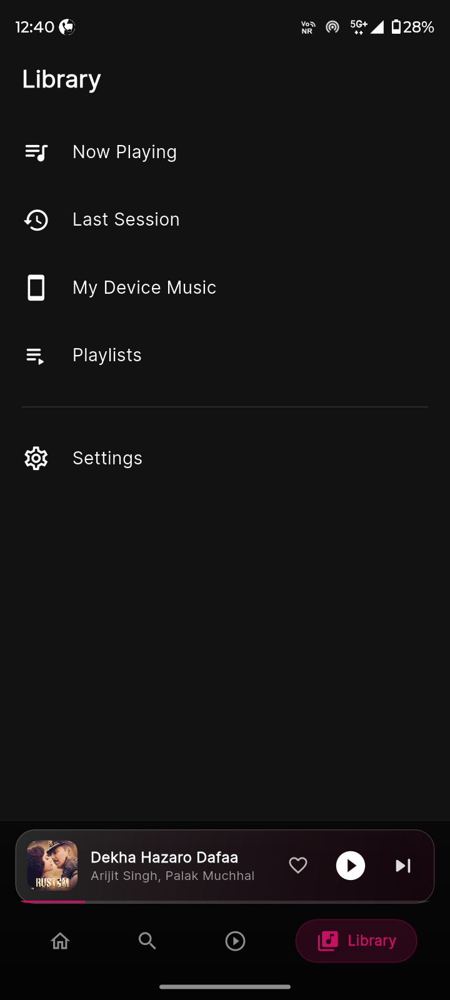
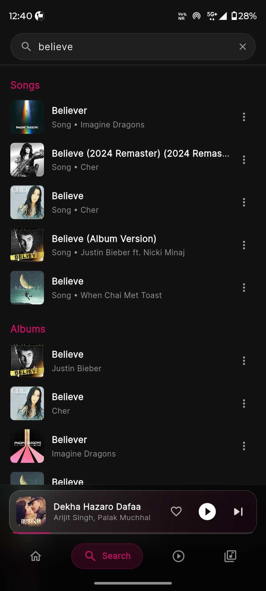
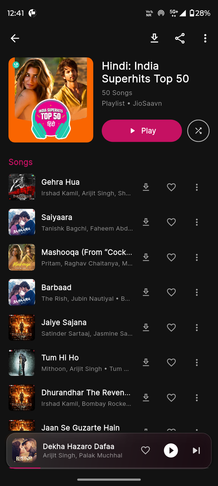
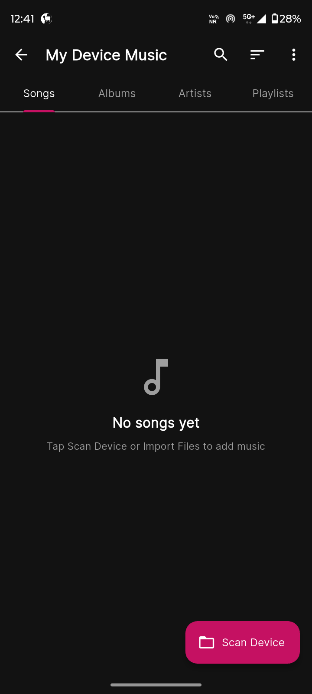

<div align="center">



# Abelo 🎵

**A blazing-fast, beautifully designed Flutter music player powered by JioSaavn**

[](https://flutter.dev)
[](https://dart.dev)
[](https://github.com/AbhayTopno/Abelo/releases)
[](LICENSE)
[](https://github.com/AbhayTopno/Abelo/releases/latest)
[](https://github.com/AbhayTopno/Abelo/releases/latest)

[**⬇ Download APK**](https://github.com/AbhayTopno/Abelo/releases/latest) · [Report Bug](https://github.com/AbhayTopno/Abelo/issues) · [Request Feature](https://github.com/AbhayTopno/Abelo/issues)

</div>

---

## 📱 Screenshots

<div align="center">

| Home | Home (Charts) | Search |
|:---:|:---:|:---:|
|  |  |  |

| Search Results | Library | Playlist |
|:---:|:---:|:---:|
|  |  |  |

| Device Music |
|:---:|
|  |

</div>

---

## ✨ Features

### 🎧 Streaming & Playback
- **JioSaavn Integration** — Stream 100 million+ songs directly with no middleware server; API calls happen on-device
- **On-Device DES Decryption** — Encrypted stream URLs are decrypted locally using `dart_des` (no server needed)
- **High-Quality Audio** — Choose your streaming quality (96 kbps → 320 kbps)
- **YouTube Playback** — Search and stream songs directly from YouTube via `youtube_explode_dart`
- **Background Playback** — Continues playing when the screen is off or you switch apps (powered by `just_audio_background`)
- **Lock-Screen Player** — Full-screen media controls shown on the lock screen (Android 14+ compatible)
- **Media Notification** — Rich media notification with artwork, playback controls, and seek bar

### 🏠 Home & Discovery
- **Personalised Feed** — "Most Played" carousel built from your listening history
- **Top Charts** — Hindi, International, and regional India Superhits Top 50 playlists
- **New Releases** — Latest albums and singles updated in real time
- **Editorial Picks** — Curated playlists from JioSaavn editorial team
- **Trending Now** — What's hot right now across India
- **Quick Pick** — AI-picked suggestions based on your recent plays
- **Moods & Genres** — Browse by mood, decade, or genre

### 🔍 Search
- **Instant Search** — Real-time results as you type across songs, albums, and artists
- **Popular Artists** — Discover top artists (Arijit Singh, Diljit Dosanjh, Shreya Ghoshal, A.R. Rahman, and more)
- **Popular Albums** — Trending albums displayed with artwork
- **Trending Searches** — See what others are searching right now
- **Moods & Genres** — Searchable genre grid
- **Full Results View** — Separate sections for Songs and Albums in results

### 📚 Library
- **Now Playing Queue** — View and reorder the current playback queue
- **Last Session** — Resume exactly where you left off
- **My Device Music** — Scan your device for local audio files (MP3, FLAC, etc.) and organise by Songs / Albums / Artists / Playlists
- **Playlists** — Create, edit, delete, and share custom playlists
- **Import Files** — Add local audio files directly via file picker

### ⬇ Downloads
- **Offline Downloads** — Download any song for offline playback with progress indicator
- **Download Management** — Track download status per song (idle / downloading / done / error)
- **Artwork Sidecar** — Album art is saved alongside the audio file automatically

### 🎨 Theme & UI
- **Dark / Light / System Mode** — Follows system theme or set manually
- **Accent Color & Hue** — Customise the pink accent to any colour
- **Glass-morphism Widgets** — Frosted-glass cards throughout the UI
- **Shimmer Loading** — Skeleton shimmer placeholders while content loads
- **Marquee Text** — Long titles scroll smoothly instead of truncating
- **Mini Player** — Persistent mini player at the bottom with like, play/pause, and next controls
- **Dense Mini Player** — Compact mode for more screen real estate
- **Animated Now Playing** — Full-screen player with album art, seek bar, and playback controls

### 📋 Playlist Management
- **Create Playlists** — Name and build playlists from any song tile
- **Playlist Picker** — Bottom-sheet picker to add songs to existing playlists
- **Reorder & Delete** — Drag to reorder, swipe to remove songs
- **Backup & Restore** — Export your playlists and settings to a file; restore anytime

### ⚙️ Settings
| Section | Options |
|---|---|
| **Theme** | Dark Mode · Accent Color & Hue · Use System Theme |
| **App UI** | Player Background Style · Mini Player Buttons · Dense Mini Player |
| **Music & Playback** | Music Language · Streaming Quality · Spotify Local Charts Location |
| **Others** | App Language · Include/Exclude Folders · Min Audio Length |
| **Backup & Restore** | Create Backup · Restore · Auto Backup |
| **About** | Version · Share App · Contact |

### 🔒 Privacy & Security
- All API requests are made directly from the device — no third-party server
- Session cookie is stored locally on-device only
- No analytics or telemetry collected

---

## 🚀 Getting Started

### Prerequisites

| Tool | Minimum Version |
|------|-----------------|
| Flutter SDK | 3.x |
| Dart SDK | 3.x |
| Android SDK | API 21+ (Android 5.0) |
| Xcode (iOS) | 14+ |

### Installation

```bash
# 1. Clone the repository
git clone https://github.com/AbhayTopno/Abelo.git
cd Abelo

# 2. Install dependencies
flutter pub get

# 3. Run on a connected device / emulator
flutter run

# 4. Build release APK (arm64)
flutter build apk --release --target-platform android-arm64
```

### ⬇ Direct APK Install (Android)

1. Download `app-arm64-v8a-release.apk` from the [Releases page](https://github.com/AbhayTopno/Abelo/releases/latest)
2. Enable **Install from unknown sources** on your Android device
3. Open the downloaded APK and install

> **Note:** The APK targets `arm64-v8a` (most modern Android devices). Enable "Install from unknown sources" in **Settings → Security** if prompted.

---

## 🏗️ Project Structure

```
Abelo/
├── android/                    # Android platform code & manifest
├── assets/
│   ├── icon/                   # App icon (adaptive)
│   └── images/                 # Static image assets
├── ios/                        # iOS platform code
├── lib/
│   ├── api/
│   │   ├── saavn_api.dart      # JioSaavn private API client + DES decryption
│   │   └── lrclib_api.dart     # Lyrics API client
│   ├── models/
│   │   └── song.dart           # Song data model
│   ├── screens/
│   │   ├── home_screen.dart    # Home feed
│   │   ├── search_screen.dart  # Search & discovery
│   │   ├── library_screen.dart # Library hub
│   │   ├── now_playing_screen.dart  # Full-screen player
│   │   ├── album_playlist_screen.dart
│   │   ├── artist_screen.dart
│   │   ├── local_music_screen.dart
│   │   ├── lock_screen_player.dart
│   │   ├── onboarding_screen.dart
│   │   ├── root_shell.dart
│   │   ├── settings_screen.dart
│   │   └── youtube_screen.dart
│   ├── services/
│   │   ├── local_music_service.dart   # Device music scanner
│   │   ├── lock_screen_service.dart   # Lock-screen overlay
│   │   ├── speed_dial_service.dart    # FAB speed dial
│   │   └── youtube_service.dart       # YouTube stream resolver
│   ├── state/
│   │   └── app_state.dart      # Central state (Provider)
│   ├── widgets/
│   │   ├── browse_row.dart     # Horizontal scrollable content rows
│   │   ├── glass_widget.dart   # Frosted-glass card widget
│   │   ├── mini_player.dart    # Persistent bottom mini player
│   │   ├── playlist_picker.dart
│   │   ├── song_tile.dart      # Reusable song list tile
│   │   └── speed_dial_widget.dart
│   ├── app_assets.dart         # Centralised asset paths
│   ├── main.dart               # App entry point & background audio init
│   └── theme.dart              # TaarTheme — colours, text styles, shapes
├── screenshots/                # App screenshots
├── test/                       # Unit & widget tests
├── pubspec.yaml
└── README.md
```

---

## 📦 Key Dependencies

| Package | Purpose |
|---|---|
| `just_audio` | Core audio playback engine |
| `just_audio_background` | Background playback & media notification |
| `audio_session` | Audio focus & session management |
| `provider` | Lightweight state management |
| `http` + `dio` | HTTP clients for API & downloads |
| `dart_des` | On-device DES/ECB decryption of stream URLs |
| `cached_network_image` | Efficient image loading & caching |
| `google_fonts` | Custom typography |
| `shimmer` | Skeleton loading animations |
| `marquee` | Scrolling text for long titles |
| `share_plus` | Share songs & playlists |
| `file_picker` | Import local audio files |
| `permission_handler` | Runtime permissions (storage, notifications) |
| `media_store_plus` | Android MediaStore access |
| `flutter_audio_tagger` | Read ID3 tags from local files |
| `youtube_explode_dart` | YouTube stream extraction |
| `home_widget` | Home-screen widget support |
| `pointycastle` | Cryptographic primitives |
| `lrclib` (via REST) | Synced & unsynced lyrics |

---

## 🤝 Contributing

Contributions are welcome! Please follow these steps:

1. **Fork** the repository
2. Create your feature branch: `git checkout -b feature/amazing-feature`
3. Commit your changes: `git commit -m 'feat: add amazing feature'`
4. Push to the branch: `git push origin feature/amazing-feature`
5. Open a **Pull Request**

Please follow [Conventional Commits](https://www.conventionalcommits.org/) for commit messages.

---

## 🐛 Known Issues / Roadmap

- [ ] Lyrics display (synced LRC support)
- [ ] Sleep timer
- [ ] Equalizer / audio effects
- [ ] Chromecast / AirPlay support
- [ ] Playlist sharing via deep link
- [ ] iOS release on App Store

---

## ⚠️ Disclaimer

Abelo is an **unofficial** client for JioSaavn. It is intended for personal use only. All music content, album art, and metadata are the property of their respective rights holders. This project is not affiliated with, endorsed by, or connected to JioSaavn or Reliance Jio Infocomm Limited.

---

## 📄 License

Distributed under the MIT License. See [`LICENSE`](LICENSE) for more information.

---

<div align="center">

Made with ❤️ and Flutter by **Abhay**

⭐ Star this repo if you find it useful!

</div>
